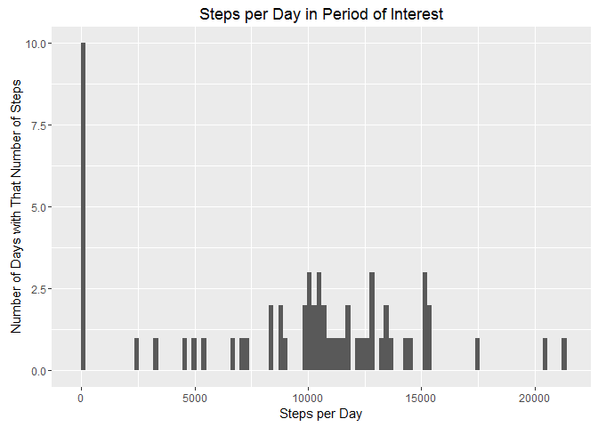
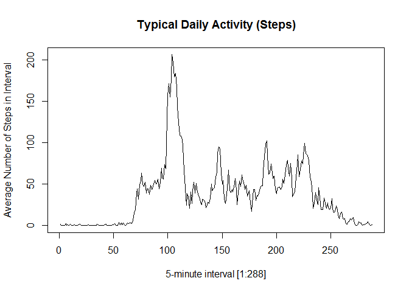

# Reproducible Research: Peer Assessment 1


## Loading and preprocessing the data

Project data was supplied as a zip file `activity.zip` which was unzipped
manually to yield `activity.csv`.  This gets loaded using `read.csv()`.


```r
require(dplyr)
require(ggplot2)

# The 'stringsAsFactors' bit makes the date field a string, which may be
# a bit silly.
# columns are date, interval, steps)
data <- read.csv("activity.csv", stringsAsFactors=FALSE)
```

We massage the data a bit to make processing simpler.


```r
# This doesn't get used exactly in this form.
naMap <- is.na(data$steps)	# a vector of 17568 elements, 2304 of them TRUE

# hour is zero-based, slot is one-based :-(
data2          <- mutate(data,
                   hour = as.integer((0.001 + interval) / 100),
                   slot = 1 + (interval %% 100) / 5 )

data3          <- select(data2, date, hour, slot, steps)
data3$date     <- as.Date(data3$date)

avgBySlot      <- select(data3, slot, steps) %>%
                  group_by(slot)             %>%
                  summarize(meanSteps=mean(steps, na.rm=TRUE))

avgByHour      <- select(data3, hour, steps) %>%
                  group_by(hour)             %>%
                  summarize(meanSteps=mean(steps, na.rm=TRUE))

# DEBUG
avgPerSlot     <- mean(avgBySlot$meanSteps)
avgPerDay      <- 288 * avgPerSlot
# END
```

So the average number of steps in any given slot is 37.3825996, which
gives an average of 1.0766189\times 10^{4} steps per day.

## What is mean total number of steps taken per day?


```r
perDay         <- select(data3, date, steps) %>%
                  group_by(as.factor(date))  %>%
                  summarize(totalSteps=sum(steps, na.rm=TRUE))

ggplot(data=perDay, aes(totalSteps)) 	           +
    xlab('Steps per Day') 		           +
    ylab('Number of Days with That Number of Steps')	   +
    ggtitle('Steps per Day in Period of Interest') +
    geom_histogram(bins=100)
```



```r
meanStepsPerDay     <- mean(perDay$totalSteps)
medianStepsPerDay   <- median(perDay$totalSteps)
meanSteps   <- sprintf("%.0f", meanStepsPerDay)
medianSteps <- sprintf("%.0f", medianStepsPerDay)
```

The figure above shows how many days in the period of interest have step
counts in various ranges (buckets).

The mean number of steps per day is 9354 and the median is
10395.  These numbers suggest that the subject of the experiment
is attempting to hit the magic target of ten thousand steps a day.

## What is the average daily activity pattern?

The 'average daily activity pattern' is understood here to be the average
for each of the 5-minute intervals
across all 60 or so days in the period
for which we have data.  There are 288 = 12x24 such 5-minute intervals in each
day; this is the number on the x-axis in the graph.  There is a sharp peak in
activity just after the 100th interval, which is around 500 minutes into the
day, suggesting that the subject went walking or running at around 08:20 in
the morning.


```r
# Add a column converting hour and slot to 'daySlot', the [1..288] index
# of this particular 5-minute slot in the day

data4  <- mutate(data3, daySlot= (hour * 12) + slot)

data5  <- select(data4, daySlot, steps) %>%
          group_by(daySlot)             %>%
          summarize(meanSteps = mean(steps, na.rm=TRUE))

plot(data5$daySlot, data5$meanSteps, type='l',
       main='Typical Daily Activity (Steps)',
       xlab='5-minute interval [1:288]',
       ylab='Average Number of Steps in Interval')
```



```r
maxMeanSteps <- max(data5$meanSteps)
```

The maximum average number of steps in any 5-minute interval was
206.17.

## Imputing missing values

### Calculate and Report Total Number of Missing Values

```r
nbrMissing <- sum(is.na(data$steps))
```

There were 2304 missing values (NA step counts) in the dataset.

### Devise a Strategy for Filling in Missing Values

The simplest approach to filling in any missing values is to just replace any
NA values with the average number of steps per 5-minute interval for the
entire dataset.


```r
avgStepsPerInterval <- meanStepsPerDay / 288
```

### Create a New Dataset With Missing Values Replaced


```r
data6 <- data3			# copy the date-hour-slot-steps data frame
data6$steps[is.na(data6$steps)] <- avgStepsPerInterval
```

### Make a Histogram of Total Steps Taken Each Day


```r
perDay2         <- select(data6, date, steps) %>%
                  group_by(as.factor(date))  %>%
                  summarize(totalSteps=sum(steps, na.rm=TRUE))

ggplot(data=perDay2, aes(totalSteps)) 	           +
    xlab('Steps per Day') 		           +
    ylab('Number of Days with That Number of Steps')	   +
    ggtitle('Steps per Day in Period of Interest') +
    geom_histogram(bins=100)
```


```r
meanStepsPerDay2     <- mean(perDay2$totalSteps)
medianStepsPerDay2   <- median(perDay2$totalSteps)
meanSteps2   <- sprintf("%.0f", meanStepsPerDay2)
medianSteps2 <- sprintf("%.0f", medianStepsPerDay2)
```

### Calculate and Report Mean and Median

After imputing missing values, the mean number of steps per day is
10581 and the median is 10395.

### Effect of Imputing on Estimates of Total Daily Steps

Imputing missing data increased the mean and median steps per day by a
significant amount, in fact by more than 10%.  This is largely because the
NAs were not randomly distributed.  In fact in the activity data set all
of the `steps` values for the first and last days were NA.  In practical
use these two days should have been simply ignored.


## Are there differences in activity patterns between weekdays and weekends?


```r
WEEKDAYS <- c('Monday', 'Tuesday', 'Wednesday', 'Thursday', 'Friday')

# data3 is <date, hour, slot, steps>

dataB  <- mutate(data3,
		daySlot   = (hour * 12) + slot,
		isWeekDay = factor(weekdays(date) %in% WEEKDAYS,
			levels=c(FALSE,TRUE), labels=c('weekend', 'weekday')))

dataC  <- select(dataB, daySlot, isWeekDay, steps) %>%
          group_by(isWeekDay, daySlot)             %>%
          summarize(meanSteps = mean(steps, na.rm=TRUE))

ggplot(data=dataC, aes(x=daySlot, y=meanSteps))                   + 		
       geom_line() + 
       ggtitle('Typical Daily Activity (Steps)')     +
       xlab('5-minute interval [1:288]')             +
       ylab('Average Number of Steps in Interval')   +
       facet_wrap(~isWeekDay)
```


From the graphs it would appear that weekend perods of exercise tend
to start a little later, are somewhat less intense, and are more dispersed.
